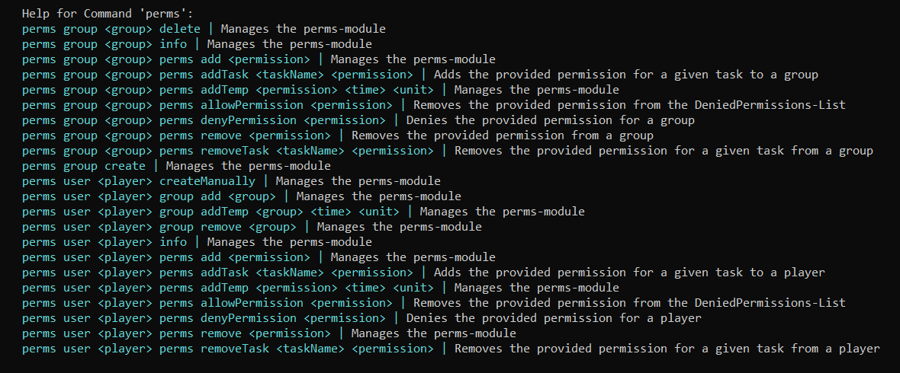

### Perms

The Perms-Module manages all of your permissions.<br>
It manages temporary and permanent permissions and groups for specific players
Great to work with its API!

**Commands usage**



**Compatible Softwares**
- BungeeCord
- Waterfall
- Spigot/Bukkit/Glowstone
<br>

**Permissions:**
````
cloud.module.perms.command.use - for use of command
````

# Documentation
    

**Understanding the Model**

The Perms-Module consists of:

- PermissionManager (manages groups & players)
- PermissionEntity (parent of both groups & players with base methods)
- PermissionPlayer (gives info about a players permissions & groups)
- PermissionGroup (gives info about data of the group)
- Permission (permission object with expirationDate of permission)

<br><br>
**Accessing the PermissionManager**
````java
/* METHOD 1 (unchecked & unsafe) */
PermissionManager pm = CloudDriver.getInstance().getProviderRegistry().getUnchecked(PermissionManager.class);
//do stuff


/* METHOD 2 (checked & safe) */
CloudDriver.getInstance().getProviderRegistry().get(PermissionManager.class).ifPresent(pm -> {
    //do stuff
});

````


**Getting PermissionPlayer**

````java
PermissionManager pm = ....

/* METHOD 1 (async) */
Task<PermissionPlayer> playerTask = pm.getPlayerAsyncByUniqueId(uuid);
playerTask.onTaskSucess(permissionPlayer -> {
//to stuff
});

/* METHOD 2 (sync) */
PermissionPlayer permissionPlayer = pm.getPlayerByUniqueIdOrNull(uuid);
//do stuff
        
------------------------------------------------------        
//methods to access
permissionPlayer.getName();                                : String
permissionPlayer.getUniqueId();                            : UUID
permissionPlayer.isInPermissionGroup("GROUPNAME");         : boolean
permissionPlayer.getPermissions();                         : Collection<Permission>
permissionPlayer.getTaskPermissions();                     : Map<IServiceTask, Collection<String>>
permissionPlayer.getTaskPermissions("TASKNAME");           : Collection<String>
permissionPlayer.getPermissionGroups();                    : Collection<PermissionGroup>
permissionPlayer.getHighestGroup();                        : PermissionGroup
permissionPlayer.getDeniedPermissions();                   : Collection<String>
permissionPlayer.hasPermission("PERMISSION");              : void
permissionPlayer.addDeniedPermission("PERMISSION");        : void
permissionPlayer.removeDeniedPermission("PERMISSION");     : void
permissionPlayer.addTaskPermission(task, "PERMISSION");    : void
permissionPlayer.removeTaskPermission(task, "PERMISSION"); : void       
permissionPlayer.update();                                 : void
````

**Getting PermissionGroups**

````java
PermissionManager pm = ....

/* METHOD 1 (async) */
Task<PermissionGroup> groupTask = pm.getPermissionGroup("Admin");
groupTask.onTaskSucess(permissionGroup -> {
//do stuff
});

/* METHOD 2 (sync) */
PermissionGroup permissionGroup = pm.getPermissionGroupByNameOrNull("Admin");
//do stuff
        
---------------------------------------------------------        
//methods to access
permissionGroup.getName();                                : String
permissionGroup.getSortId();                              : String
permissionGroup.getColor();                               : String
permissionGroup.getChatColor();                           : String
permissionGroup.getPrefix();                              : String
permissionGroup.getNamePrefix();                          : String
permissionGroup.getSuffix();                              : String
permissionGroup.isDefaultGroup();                         : boolean
permissionGroup.getInheritedGroups();                     : Collection<String>
permissionGroup.findInheritedGroups();                    : Collection<PermissionGroup>
permissionGroup.addInheritedGroup("GROUPNAME");           : void
permissionGroup.removeInheritedGroup("GROUPNAME");        : void
permissionGroup.getPermissions();                         : Collection<Permission>
permissionGroup.getDeniedPermissions();                   : Collection<String>
permissionGroup.addDeniedPermission("PERMISSION");        : void
permissionGroup.removeDeniedPermission("PERMISSION");     : void
permissionGroup.addTaskPermission(task, "PERMISSION")     : void
permissionGroup.removeTaskPermission(task, "PERMISSION"); : void
permissionGroup.update();                                 : void
````

**Working with Permission Objects**

You can either provide a plain String as Permission or a unique "Permission" Instance if you'd like to.
The feature of Object-Permissions is that they can expire if set.

````java

PermissionManager pm = ....
PermissionPlayer player = ....

//getting permissions
Task<Permission> permsTask = player.getPermission("system.test");
permsTask.onTaskComplete(permission -> {
   if (permission.hasExpired()) {
        //has expired do stuff   
    } 
});

Permission permission = player.getPermissionOrNull("system.test");
if (permission.hasExpired()) {
    //has expired do stuff   
}


//methods to access
        
-----------------------------------------------
permission.getPermission()     : String
permission.hasExpired()        : boolean
permission.getExpirationDate() : long
````

## Modifying Player/Group Data

Whenever you decide to modify the data of a PermissionGroup or PermissionPlayer
it is very important to call the #update() method after making changes to make these
changes are being applied on every service.

### Player Modification

- *Adding to a group (temporary/permanent) :*
    ````java
    PermissionPlayer player = ....
    PermissionGroup group = ....

    permissionPlayer.addPermissionGroup(group, TimeUnit.DAYS, 30); //adds player to group instance for 30 days
    permissionPlayer.addPermissionGroup(group; //adds player to group instance permanently
    permissionPlayer.update();
    ````

- *Removing from a group:*
    ````java
    PermissionPlayer player = ....

    permissionPlayer.removePermissionGroup("GROUPNAME"); 
    permissionPlayer.update();
    ````

- *Adding a Permission (temporary/permanent):*
    ````java
    PermissionPlayer player = ....

    Permission permission = Permission.of("system.admin", TimeUnit.HOURS, 1);
    
    permissionPlayer.addPermission(permission); //adds "system.admin" to player for 1 hour
    permissionPlayer.update();
    ````

- *Removing a Permission:*
    ````java
    PermissionPlayer player = ....

    Permission permission = player.getPermissionOrNull("system.admin"); //searching for permisison instance in cached perms
    
    permissionPlayer.removePermission(permission);
    permissionPlayer.update();
    ````
