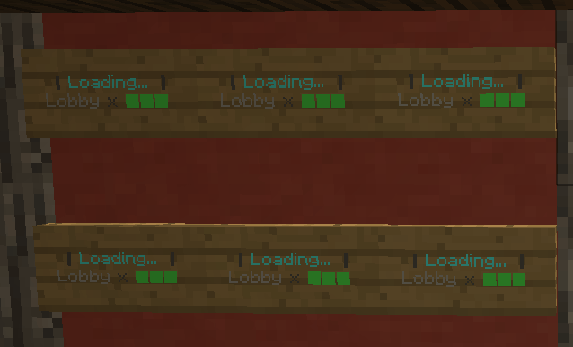
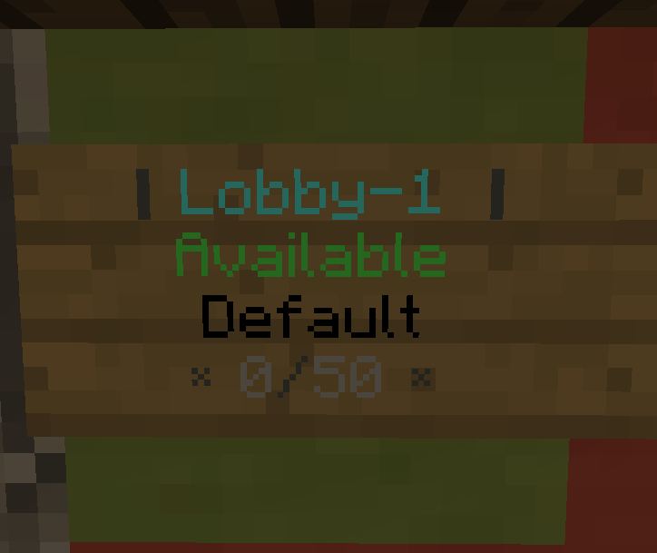

### Signs

The Sign-Module makes sure that you can make your Lobby-Servers look more professional.
You can switch between servers by clicking on signs that you can customize as much as you wish to.

**Commands usage**
- signs (rl) | reloads the sign module
- sign remove | removes a sign you are standing in-front of
- sign add (task) | adds the sign you are looking at for the task

**Compatible Softwares**
- Spigot/Bukkit/Glowstone
<br>

**Screenshots**


**Permissions:**
````
cloud.module.sign.command.use - for use of command
````

**Default config**

````json
{
  "fullLayout": {
    "repeatingTick": 20,
    "signLayouts": [
      {
        "lines": [
          "&8│ &b{server.name} &8│",
          "&6VIP",
          "{server.motd}",
          "&8× &7{server.online}}&8/&7{server.max} &8×"
        ],
        "blockName": "STAINED_CLAY",
        "subId": 1
      }
    ]
  },
  "knockBackConfig": {
    "enabled": true,
    "strength": 0.7,
    "distance": 0.5,
    "byPassPermission": "cloud.hytora.module.signs.knockback.bypass"
  },
  "onlineLayout": {
    "repeatingTick": 20,
    "signLayouts": [
      {
        "lines": [
          "&8│ &b{server.name} &8│",
          "&aAvailable",
          "{server.motd}",
          "&8× &7{server.online}&8/&7{server.max} &8×"
        ],
        "blockName": "STAINED_CLAY",
        "subId": 5
      },
      {
        "lines": [
          "&8│ &b{server.name} &8│",
          "&aUptime:",
          "{server.uptime}",
          "&8× &7{server.online}&8/&7{server.max} &8×"
        ],
        "blockName": "STAINED_CLAY",
        "subId": 5
      },
      {
        "lines": [
          "&8│ &b{server.name} &8│",
          "&aUptime:",
          "{server.uptime}",
          "&8× &7{server.online}&8/&7{server.max} &8×"
        ],
        "blockName": "STAINED_CLAY",
        "subId": 5
      },
      {
        "lines": [
          "&8│ &b{server.name} &8│",
          "&aAvailable",
          "{server.motd}",
          "&8× &7{server.online}&8/&7{server.max} &8×"
        ],
        "blockName": "STAINED_CLAY",
        "subId": 5
      }
    ]
  },
  "startingLayOut": {
    "repeatingTick": 20,
    "signLayouts": [
      {
        "lines": [
          "",
          "&8│ &e{server.name} &8│",
          "&8× &0Starting. &8×",
          ""
        ],
        "blockName": "STAINED_CLAY",
        "subId": 4
      },
      {
        "lines": [
          "",
          "&8│ &e{server.name} &8│",
          "&8× &0Starting.. &8×",
          ""
        ],
        "blockName": "STAINED_CLAY",
        "subId": 4
      },
      {
        "lines": [
          "",
          "&8│ &e{server.name} &8│",
          "&8× &0Starting... &8×",
          ""
        ],
        "blockName": "STAINED_CLAY",
        "subId": 4
      },
      {
        "lines": [
          "",
          "&8│ &e{server.name} &8│",
          "&8× &0Starting.. &8×",
          ""
        ],
        "blockName": "STAINED_CLAY",
        "subId": 4
      },
      {
        "lines": [
          "",
          "&8│ &e{server.name} &8│",
          "&8× &0Starting. &8×",
          ""
        ],
        "blockName": "STAINED_CLAY",
        "subId": 4
      },
      {
        "lines": [
          "",
          "&8│ &e{server.name} &8│",
          "&8× &0Starting &8×",
          ""
        ],
        "blockName": "STAINED_CLAY",
        "subId": 4
      }
    ]
  },
  "maintenanceLayout": {
    "repeatingTick": 20,
    "signLayouts": [
      {
        "lines": [
          "",
          "&8│ &b{task.name} &8│",
          "&8× &cMaintenance &8×",
          ""
        ],
        "blockName": "STAINED_CLAY",
        "subId": 3
      }
    ]
  },
  "loadingLayout": {
    "repeatingTick": 20,
    "signLayouts": [
      {
        "lines": [
          "",
          "&8│ &bLoading... &8│",
          "&7{task.name} &8x &a⬛&7⬛⬛",
          ""
        ],
        "blockName": "STAINED_CLAY",
        "subId": 14
      },
      {
        "lines": [
          "",
          "&8│ &bLoading... &8│",
          "&7{task.name} &8x &a⬛⬛&7⬛",
          ""
        ],
        "blockName": "STAINED_CLAY",
        "subId": 14
      },
      {
        "lines": [
          "",
          "&8│ &bLoading... &8│",
          "&7{task.name} &8x &a⬛⬛⬛",
          ""
        ],
        "blockName": "STAINED_CLAY",
        "subId": 14
      },
      {
        "lines": [
          "",
          "&8│ &bLoading... &8│",
          "&7{task.name} &8x &7⬛⬛⬛",
          ""
        ],
        "blockName": "STAINED_CLAY",
        "subId": 14
      }
    ]
  }
}
````